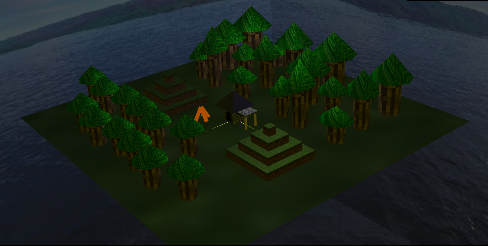
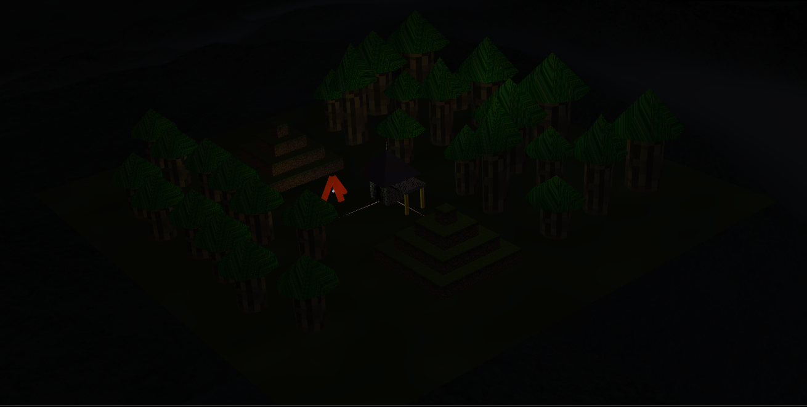
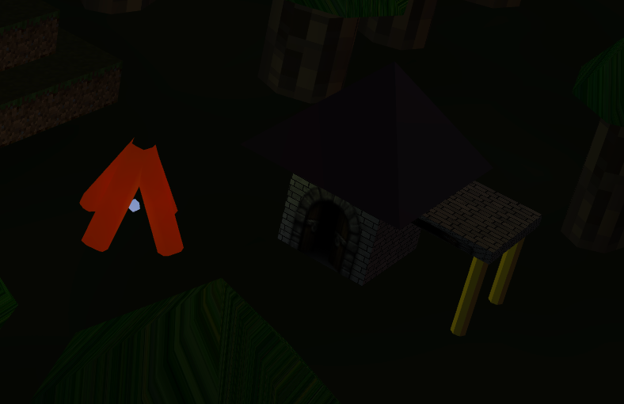
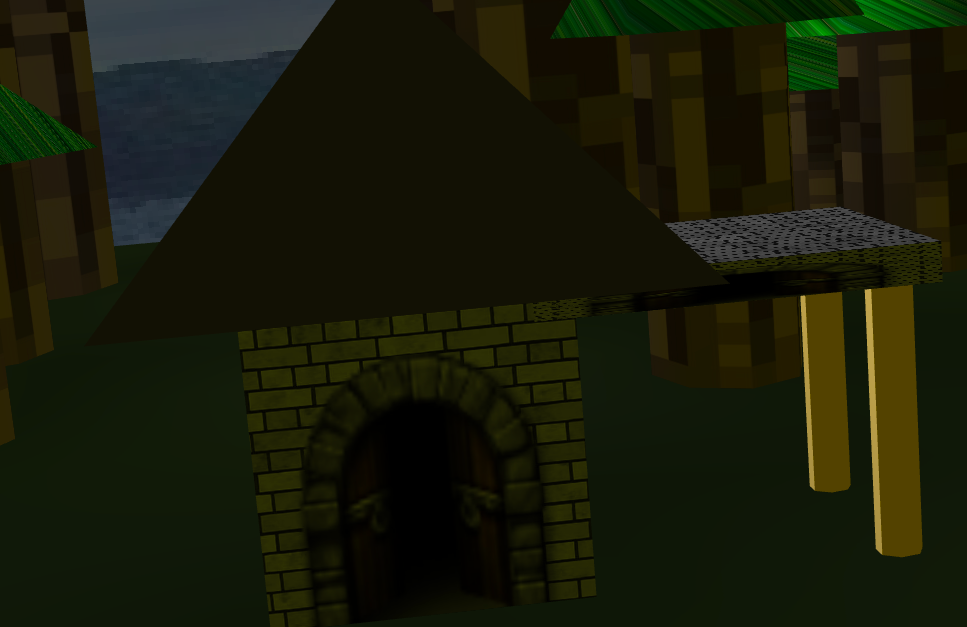
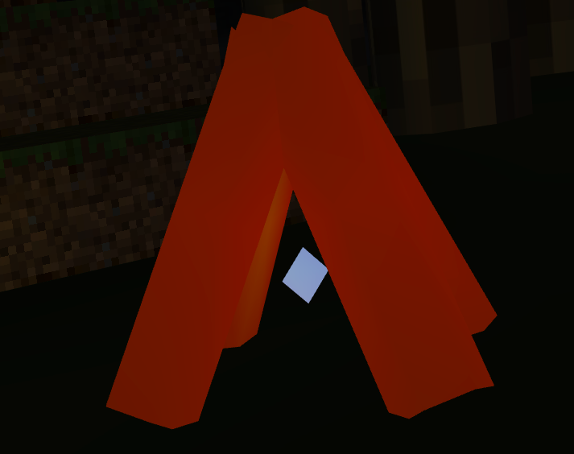
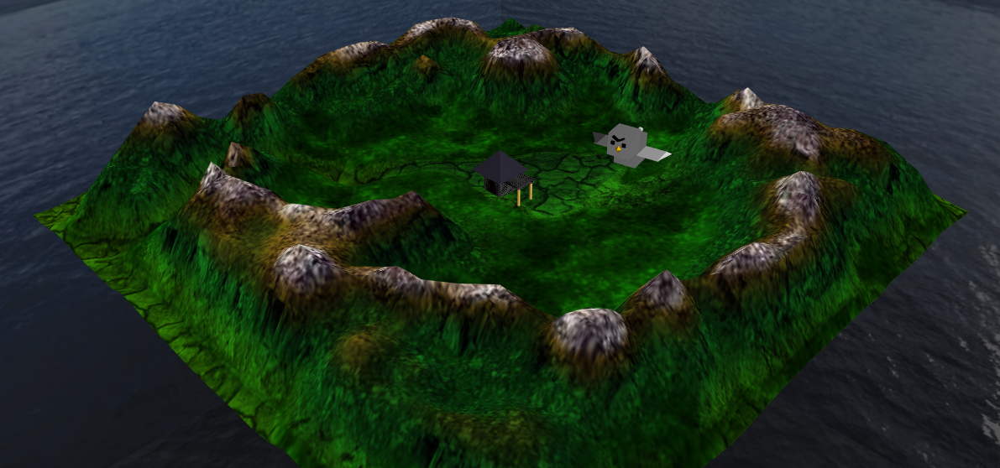
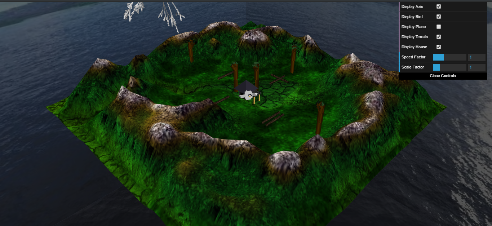

# CGRA

Projects developed in the **Computer Graphics** class.

## Project A

The goal of this project is to use the elements and techniques developed during classes to create a scene using:
* A terrain
* Groups of trees
* A house
* Elevations
* Lights to simulate daytime, nighttime and a lantern

Project A screenshots can be found [here](#proj-a) and the source code is found [here](projetos/projA/).

## Project B

The goal of this project is to create a scene using:
* A house and a Skybox created in [Project A](#project-a)
* A terrain with elevations, with the use of shaders
* A forest made of trees using Procedural Generation
* An animated bird that can be controlled by the user, as well as a bird nest

Screenshots can be found [here](#proj-b) and the source code is found [here](projetos/projB/).

## Screenshots

### Proj. A

### Proj. B

